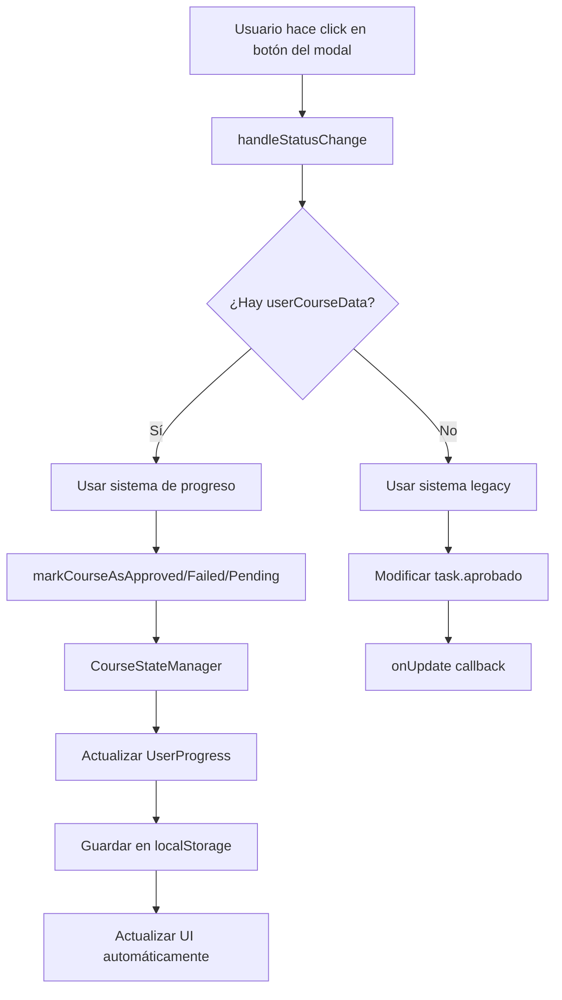

# Modal Integrado con Sistema de Progreso

Este documento explica cómo se ha conectado el modal de detalles de curso (`TaskDetailModal`) con el sistema de progreso del usuario para que los botones "Aprobado/En Curso/Reprobado" funcionen correctamente.

## Arquitectura de la Solución

### 1. Componentes Modificados

#### `TaskDetailModal`
- **Nuevas props añadidas:**
  - `userCourseData`: Datos del curso del usuario (estado, VTR, instanceId)
  - `onMarkAsApproved`: Función para marcar como aprobado
  - `onMarkAsFailed`: Función para marcar como reprobado
  - `onMarkAsPending`: Función para marcar como pendiente

- **Funcionalidad mejorada:**
  - Los botones ahora usan el sistema de progreso en lugar de solo modificar `task.aprobado`
  - Muestra información del VTR cuando es > 1
  - Incluye fallback al sistema anterior para compatibilidad
  - Muestra estado de carga durante las operaciones

#### `CourseStateManager`
- **Nueva función añadida:**
  - `markCourseAsPending()`: Marca un curso como pendiente

#### `DataManager`
- **Nueva función añadida:**
  - `markCourseAsPending()`: Wrapper para la función del CourseStateManager

#### `useUserProgress`
- **Nueva función añadida:**
  - `markCourseAsPending()`: Hook para marcar cursos como pendientes

### 2. Flujo de Funcionamiento



### 3. Estados de Curso

El sistema maneja tres estados principales:

- **`'pendiente'`**: Curso no completado (En Curso)
- **`'aprobado'`**: Curso completado exitosamente
- **`'reprobado'`**: Curso no aprobado (crea automáticamente una copia en el siguiente semestre)

### 4. Manejo de Reprobaciones

Cuando un curso se marca como reprobado:

1. Se actualiza el estado del curso actual a `'reprobado'`
2. Se crea automáticamente una copia en el siguiente semestre
3. Se incrementa el VTR (Veces Tomado el Ramo)
4. Se mantiene un registro de reprobación con todas las instancias

## Ejemplo de Uso

### Componente Básico

```tsx
import { useUserProgress } from "@/hooks/use-user-progress"
import TaskDetailModal from "./task-detail-modal"

function MiComponente() {
  const {
    markCourseAsApproved,
    markCourseAsFailed,
    markCourseAsPending,
    userProgress
  } = useUserProgress(cursos, 'INF')

  const getUserCourseData = (task: Task) => {
    // Buscar datos del usuario para esta tarea
    for (const semestreId in userProgress?.semestres) {
      const semestre = userProgress.semestres[semestreId]
      const userCourse = semestre.cursos.find(
        curso => curso.cursoId === task.cursoId
      )
      
      if (userCourse) {
        return {
          estado: userCourse.estado,
          vtr: userCourse.vtr,
          instanceId: userCourse.instanceId,
        }
      }
    }
    return undefined
  }

  return (
    <TaskDetailModal
      task={selectedTask}
      onClose={handleClose}
      onUpdate={handleUpdate}
      onDelete={handleDelete}
      onDuplicate={handleDuplicate}
      columns={columns}
      // Props del sistema de progreso
      userCourseData={getUserCourseData(selectedTask)}
      onMarkAsApproved={markCourseAsApproved}
      onMarkAsFailed={markCourseAsFailed}
      onMarkAsPending={markCourseAsPending}
    />
  )
}
```

### Ejemplo Completo

Ver `components/integrated-modal-example.tsx` para un ejemplo completo funcional.

## Página de Prueba

Se ha creado una página de prueba en `/test-modal` que demuestra:

1. **Añadir cursos**: Click en cursos del sidebar para añadirlos al semestre I
2. **Abrir modal**: Click en cualquier curso para abrir el modal de detalles
3. **Cambiar estados**: Usar los botones "Aprobado", "En Curso", "Reprobado"
4. **Ver reprobaciones**: Los cursos reprobados crean automáticamente copias
5. **Persistencia**: Los cambios se guardan en localStorage

## Características Implementadas

### ✅ Funcionalidades Completadas

- [x] Botones del modal conectados al sistema de progreso
- [x] Manejo automático de reprobaciones y copias
- [x] Persistencia en localStorage
- [x] Actualización automática de la UI
- [x] Manejo de VTR (Veces Tomado el Ramo)
- [x] Fallback al sistema anterior para compatibilidad
- [x] Estados de carga durante operaciones
- [x] Validación y manejo de errores

### 🔄 Funcionalidades del Sistema de Progreso

- [x] `markCourseAsApproved()` - Marcar como aprobado
- [x] `markCourseAsFailed()` - Marcar como reprobado (crea copia automática)
- [x] `markCourseAsPending()` - Marcar como pendiente
- [x] `addCourseToSemester()` - Añadir curso a semestre
- [x] `removeCourseWithCascade()` - Eliminar curso y copias
- [x] `moveCourse()` - Mover curso entre semestres

### 📊 Información Mostrada en el Modal

- [x] Estado actual del curso (pendiente/aprobado/reprobado)
- [x] VTR cuando es mayor a 1
- [x] ID de instancia del curso
- [x] Información técnica del sistema de progreso

## Próximos Pasos

Para integrar completamente en el sistema principal:

1. **Modificar `KanbanBoard`**: Integrar el hook `useUserProgress`
2. **Actualizar `AppContainer`**: Usar el sistema de progreso en lugar de datos estáticos
3. **Migrar datos existentes**: Convertir el sistema actual al nuevo formato
4. **Añadir validaciones**: Verificar prerrequisitos antes de cambiar estados
5. **Mejorar UX**: Añadir confirmaciones para operaciones críticas

## Archivos Modificados

- `components/task-detail-modal.tsx` - Modal con sistema de progreso integrado
- `lib/course-state-manager.ts` - Añadida función `markCourseAsPending`
- `lib/data-manager.ts` - Añadida función `markCourseAsPending`
- `hooks/use-user-progress.ts` - Añadida función `markCourseAsPending`
- `components/integrated-modal-example.tsx` - Ejemplo de integración completa
- `app/test-modal/page.tsx` - Página de prueba

## Testing

Para probar la funcionalidad:

1. Ejecutar el proyecto: `npm run dev`
2. Navegar a `/test-modal`
3. Seguir las instrucciones en pantalla
4. Verificar que los cambios persisten al recargar la página
5. Comprobar el localStorage en las herramientas de desarrollador
